# 파일 확장자 차단

## 💁🏻‍♂️요구사항

### 1-1. 고정확장자의 default는 unchecked

### 1-2. 고정확장자를 check || unchecked 할 경우 새로고침해도 유지  (아래쪽 커스텀확장자에는 표현되지 않으니 유의)

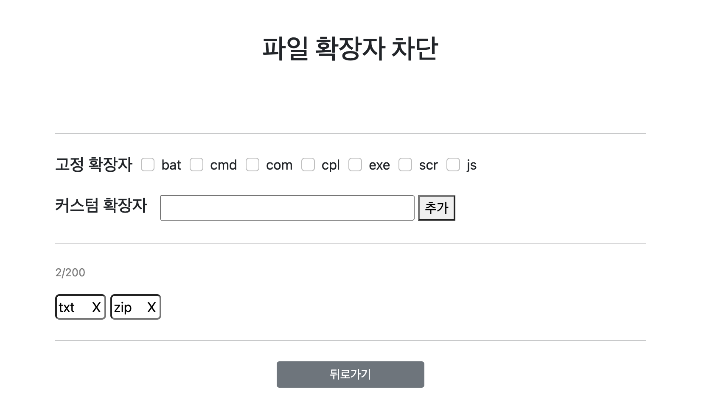

###### 기본 실행 화면 (고정확장자 모두 unchecked)

요구사항 1-2에 괄호부분때문에 어떻게 처리해야할까 고민이 많았다.

밑에 차단된 확장자부분을 db에 입력값을 꺼내 보여주는 것이라고 생각했는데 
체크된 고정확장자는 표현되진 않는다고 하니
커스텀과 고정확장자를 아예 분리해서 db관리를 해야 한다는걸까, 
db에 넣되 hidden을 줘서 숨겨서 해야하나 고민을 거듭하다가
cookie로 처리하기로 결정. 
정말 db를 띄워서 하는 프로젝트라 하더라도 쿠키 set부분에 db로 값을 보내는 로직만 추가하면 되겠지 하는 생각으로..어쨌든 새로고침시에도 값을 유지할 순 있고 밑에 차단된 확장자 표현되지 않으니 

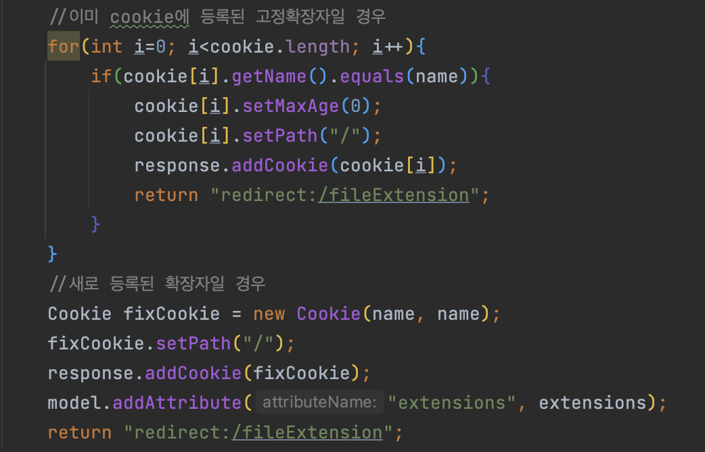

###### ExtensionController.extension()

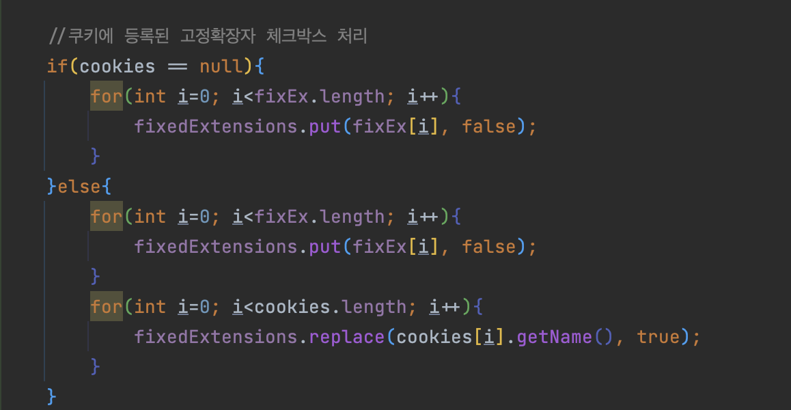

###### ExtensionController.addExtension()

체크박스에서 값이 체크되면 받아온 value값으로 쿠키를 세팅하고 
Map에 key는 쿠키이름, value는 쿠키에 등록된 상태면 true를 넣어서 redirect.
html 페이지는 `th:checked="${fixedExtension.value eq true}"` 로 처리.

반대로 uncheck시에는 쿠키를 만료시켜서 map.value를 false로 만들어 넘겼다.

---

## 2-1. 확장자 최대 입력길이는 20자리
2-2. 추가버튼 클릭시 db저장, 아래쪽 영역에 표현

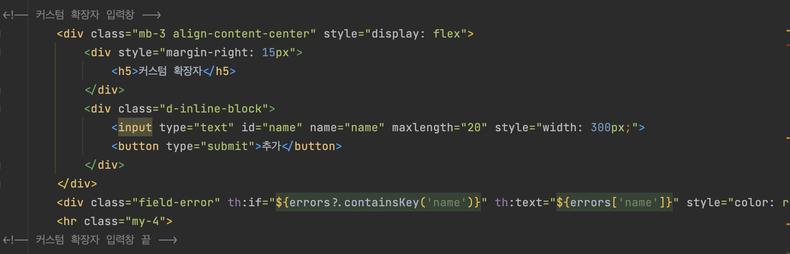

###### list.html

최대입력길이는 input태그에 maxlength로 간단히 처리

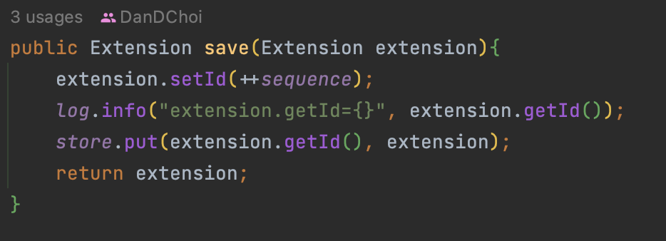

###### ExtensionController.save()

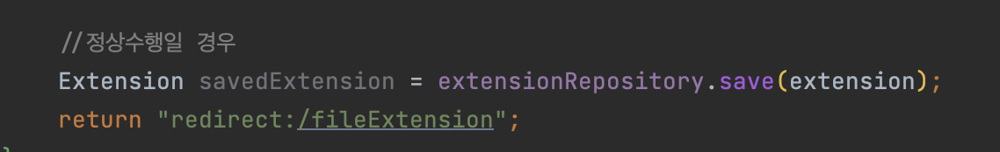

###### ExtensionController.addExtension()

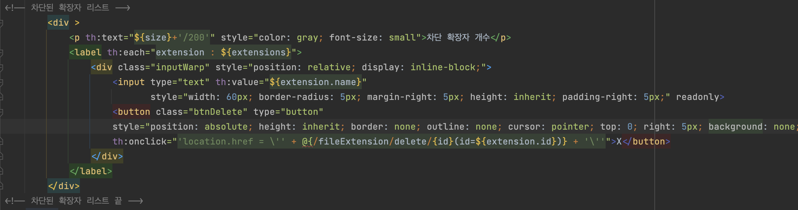

###### list.html

h2라도 연결해서 할까 하다가 극히 작은 프로젝트라 repository를 만들어 메모리로 저장.

간단히 id값을 증가시키고 추가확장자 들어오는 값을 name으로 받아 저장하고

페이지부분은 thymeleaf를 사용해서 저장된 값을 반복해서 꺼내오게 했다.

---

## 3-1. 커스텀 확장자는 최대 200개까지 가능
3-2. 확장자 옆 x클릭시 삭제

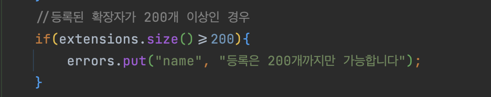

###### ExtensionController.addExtension()

List에 담긴 extension객체들의 size로 validation검사

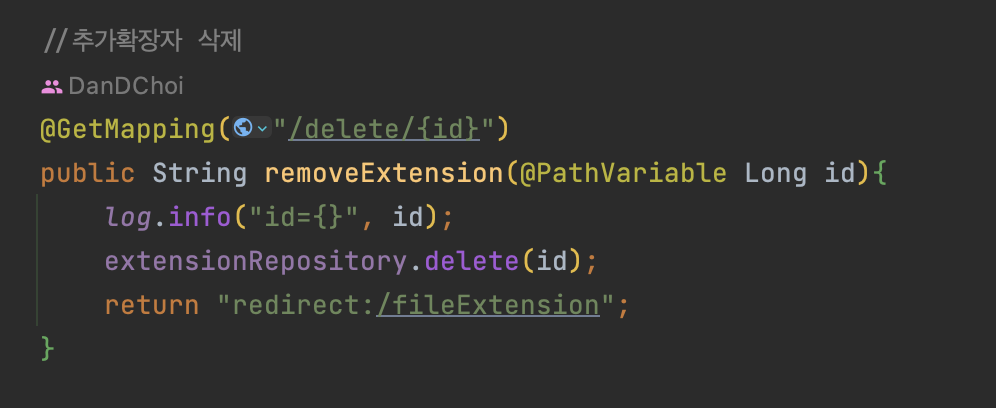

###### ExtensionController.removeExtension()

삭제는 클릭시 `th:onclick="'location.href = \'' + @{/fileExtension/delete/{id}(id=${extension.id})} + '\''"` 로 id값을 같이 보내고 컨트롤러에서 @PathVariable 로 받아서 삭제로직 처리

---

## 🙋🏻‍♂️추가고려사항

- 유효성 검사 
기본적인 유효성검사가 필요하다고 판단.
간단한 5가지 검사 추가
1) 영문자만 입력 가능
2) 중복 추가 불가
3) 등록가능 확장자 200개 
4) 빈값 추가 불가
5) 고정확장자에 있는 값은 추가 불가

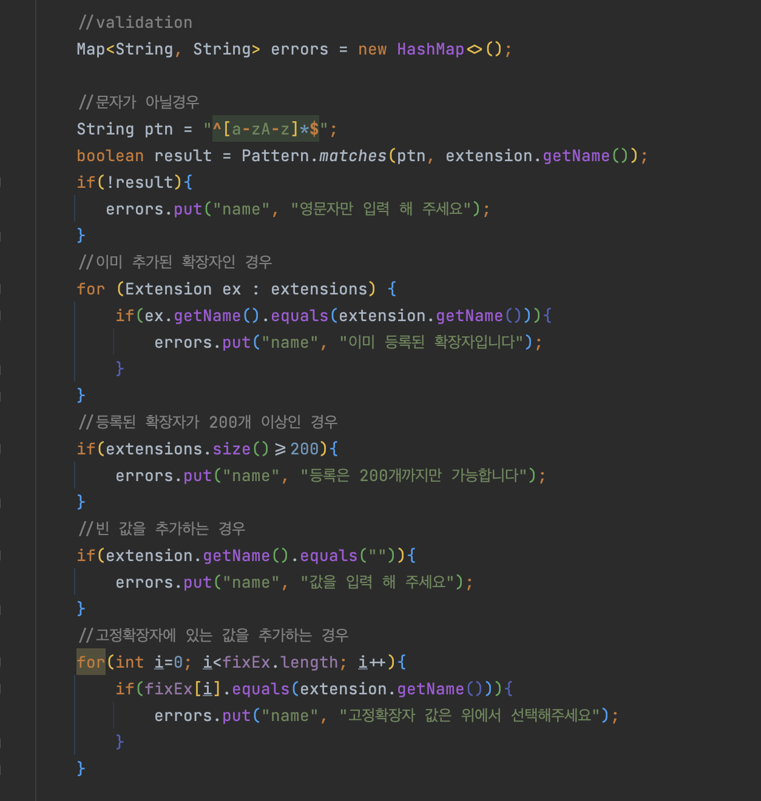

검사중 에러에 해당하는 경우
Map에 필드이름, 에러메시지를 담아 model.attribute에 담아서 보냄.
김영한님의 강의에서 배운 BindingResult같은 인터페이스를 사용해볼까 했지만
굳이 필요하지 않을 것 같아서 간단하게 처리했다.

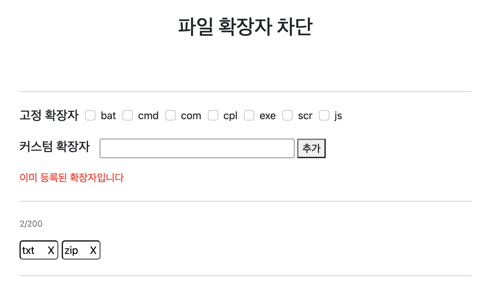

###### 에러발생시 페이지 모습

---

### 🧾후기

위에서도 언급했지만 가장 애를 먹었던 것은 고정확장자 부분이었다.
처음 구상할때는 고정확장자와 추가확장자 모두 같은 db테이블에 들어가고
밑의 추가된 확장자를 보여주는 영역에서는 db값을 가져오면 되겠다 싶었는데
고정확장자는 표현되지 않는다는 것에서 어떤식으로 해야할지가 고민됐다.

고정확장자를 따로 도메인을 만들어서 관리하자니 중복코드가 너무 많아질것이고,
체크박스 표시했을때 같은 테이블에 저장은 하지만 보여지지만 않게 하자니
html페이지에서 고정확장자 이름값을 비교해서 hidden을 해야하니 복잡할 것 같았다.

그래서 내린 결론이 쿠키사용을 하자 였다. 추후에 db를 연결해야 한다면 쿠키 세팅과 만료시키는 부분을
db삽입 삭제 로직으로 변경한다고 치고.. 

그 이후에 만난 또 다른 문제는 고정확장자 부분은 submit 버튼이 따로 없기때문에
체크를 하는 순간 submit처럼 값을 보내고 받고 해야한다는 것.
체크박스를 보통 이런식으로 사용해 본 적이 없었기 때문에 이걸 비동기처리를 해야할지
스크립트 이벤트를 줘서 체크를 해야할지 이런저런 시도를 하면서 수많은 에러를 만나고..

결국 자신없는 스크립트는 과감하게 배제하고 체크박스 onchange시에 value값을 넣어서 
GetMapping으로 받고 쿠키만 생성시키고 리다이렉트 했다
고정확장자 이름들은 미리 배열에 담아두고 배열을 돌면서 쿠키에 이름과 동일하면 
map에 true를 넣어서 반환하는 방법으로 완료했다.
일단 요구사항은 모두 맞췄지만 석연치 않은 찝찝함이 남아있는 느낌이다.
